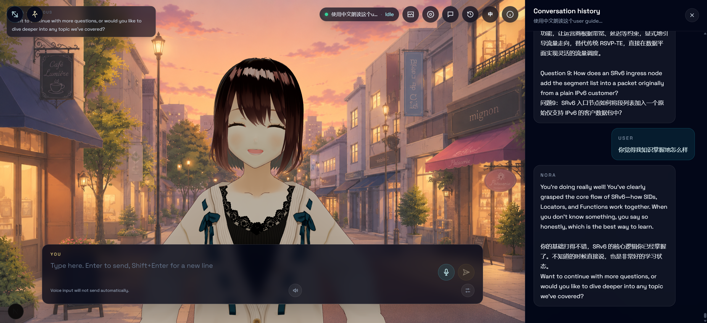
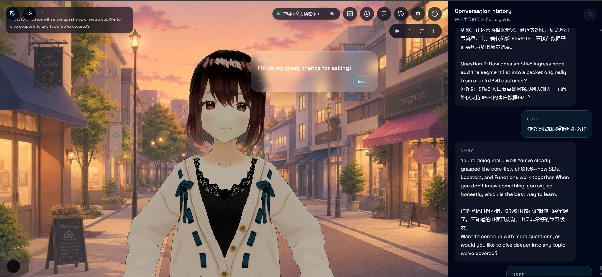
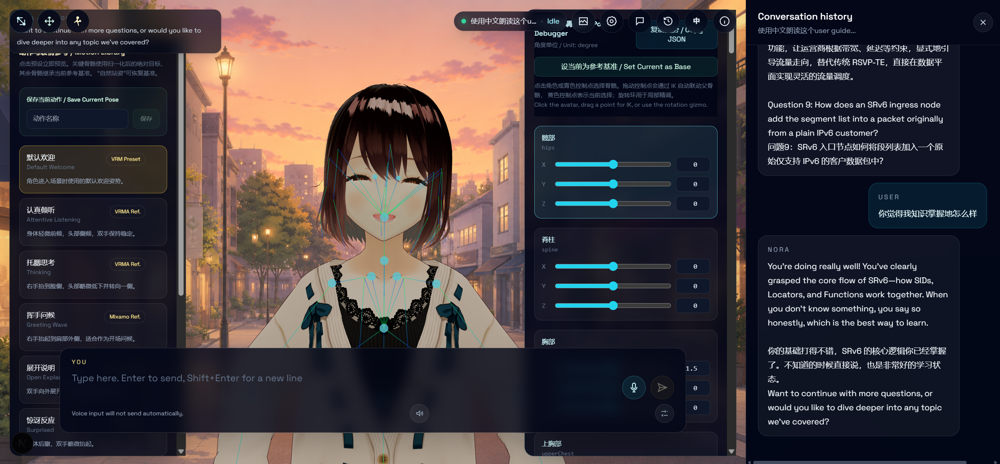

# Nora AI Avatar

An interactive browser-based AI avatar built with Next.js, React Three Fiber, Three.js, and VRM.

Nora supports OpenAI-compatible chat APIs, streaming subtitles, browser speech input and output,
avatar expressions, lip sync, multiple conversations, selectable scenes, and configurable VRM
characters.




## Features

- OpenAI-compatible streaming chat, including DeepSeek-compatible endpoints
- Multiple local conversations with independent model context
- Full-screen VRM scene with expression and lip-sync feedback
- Browser speech recognition and text-to-speech
- Sentence-by-sentence automatic or manual subtitle playback
- English and Chinese interface
- 3D, HDRI, PBR, and illustrated background presets
- Selectable system voices, speech rate, and pitch
- Runtime model API settings
- Optional camera rotation, panning, pose debugging, and motion reference tools

## Project Vision

Most AI products deliver useful information through an interface that still feels like a command
line: the user types, waits, and receives a large block of text. Nora explores a more human form of
delivery.

The project treats an AI response as a small performance rather than a plain message. The answer
appears inside the scene, is divided into readable sentences, can be spoken one sentence at a time,
and is supported by facial expressions, lip movement, posture, and environmental presentation.
The goal is not to pretend that the model is human. The goal is to make interacting with a model
feel warmer, clearer, and less mentally tiring.

Nora is designed around several principles:

- **Conversation should have presence.** The avatar remains visible while listening, thinking, and
  speaking, so the response feels connected to a character rather than detached from the scene.
- **Long answers should have rhythm.** Replies are divided into sentences instead of appearing as
  one dense wall of text.
- **The user should control the pace.** Automatic playback is useful for casual conversation;
  manual playback is useful for stories, language practice, demonstrations, and careful reading.
- **Voice and text should cooperate.** Speech follows the currently displayed sentence, while text
  remains available for accessibility and review.
- **Emotion should be expressed, not narrated.** Supported emoji and expression directions are
  removed from spoken output and translated into avatar expressions.
- **Context should remain visible.** Nora's five most recent dialogue units stay in the scene while
  the user prepares a reply, and the complete conversation is available in a persistent side
  drawer.
- **The experience should be adaptable.** Users can change scenes, avatars, language, model
  provider, voice, playback style, and conversation without leaving the main stage.

This makes the project suitable not only for casual chat, but also for interactive fiction,
virtual companions, guided learning, character demonstrations, museum or event guides, customer
experiences, and other applications where the manner of delivery matters as much as the answer.

## User Guide

### First Launch

1. Start the application and open it in a modern browser.
2. Nora appears in the selected scene. The default scene for a new browser profile is
   **Sunset Street**.
3. Configure an OpenAI-compatible provider through `.env.local`, or open **Settings** in the page
   and enter a Base URL, model name, and API key.
4. Type in the dialogue box at the bottom of the scene, then press `Enter` or select **Send**.
5. Nora's response streams into the scene and is presented one sentence at a time.

The current session name and avatar state appear at the top right. The possible states are
**Idle**, **Listening**, **Thinking**, and **Speaking**.

### Main Scene Controls

The icon dock in the upper-right corner contains the primary controls. Hover over an icon to see
its accessible label.

| Button | Purpose |
| --- | --- |
| **Scene & Avatar** | Opens the appearance panel. Select a built-in scene, choose an installed VRM avatar, or load a licensed avatar from a local or remote URL. |
| **Settings** | Configures the OpenAI-compatible endpoint and generation parameters. |
| **Sessions** | Creates, selects, renames, and deletes independent conversations. |
| **History** | Opens or closes the conversation-history drawer on the right side of the page. The drawer shares the page with the scene instead of covering it. |
| **EN / Chinese** | Switches the interface language between English and Chinese. English is the default. |
| **About** | Shows a short description of Nora, scene controls, session storage, and privacy behavior. |

All modal panels can be closed with their **X** button or by selecting the dark area outside the
panel.

### Writing And Sending A Message

The input area is part of the scene rather than a separate chat page.

- Type a message in the **You** subtitle panel.
- Press `Enter` to send.
- Press `Shift+Enter` to insert a new line.
- Select the **microphone** button to start browser speech recognition.
- Select the **stop** button to stop recording.
- Review recognized text before sending. Voice input never sends automatically.
- Select the **paper-plane Send** button to submit the current text.
- A rotating send icon indicates that the model is generating a reply.

After a message is sent, the user line does not require an additional confirmation step. Nora's
reply becomes the active scene dialogue as soon as response text is available.

### Dialogue Playback

Nora splits a multi-sentence answer into smaller scene dialogue cards. A counter such as `2 / 5`
shows the current sentence and total number of sentences.

The compact toolbar near the upper-right side of the scene appears while dialogue is active:

| Button | Purpose |
| --- | --- |
| **Speaker** | Enables or mutes spoken replies. Muting also stops the sentence currently being spoken. |
| **Voice Sliders** | Opens voice selection, speech-rate, pitch, and preview controls. |
| **Subtitle / Bubble** | Switches between a cinematic subtitle at the bottom of the scene and a speech bubble near the avatar. |
| **Auto / Manual** | Switches sentence progression between automatic timing and user confirmation. |

In **Automatic** mode:

- Each sentence remains visible for a duration based on its length.
- When speech output is enabled, the next sentence waits until the current sentence finishes
  speaking.
- The final sentence closes automatically after playback.

In **Manual** mode:

- Select **Next** to reveal and speak the following sentence.
- Select **Finish** on the final sentence to close the dialogue and return to the input panel.
- Speech reads only the sentence currently shown, not the complete answer at once.

The selected playback mode and subtitle style are stored in the browser and restored on the next
visit.

### Voice Controls

Select the **Voice Sliders** button from either the input panel or active-dialogue toolbar.

- **Voice Engine** switches between natural cloud speech and the browser's system speech.
- **Natural Cloud Voice** sends each displayed sentence to the selected cloud provider and plays
  the generated audio. Doubao Speech Synthesis 2.0 is the default provider.
- **Cloud Provider** switches between Doubao Speech Synthesis 2.0 and an OpenAI-compatible
  `/audio/speech` endpoint.
- **System Browser Voice** uses voices supplied by the operating system and browser as a free,
  offline-friendly fallback.
- **Doubao API Key** uses the API Key issued by the current Volcengine console.
- **App ID / Access Token** provides compatibility with credentials from the legacy console.
- **Resource ID** selects the Doubao service resource. Speech Synthesis 2.0 uses `seed-tts-2.0`.
- **Speaker ID** selects a voice enabled for the Volcengine account.
- **Model / Voice / Speaking Style** configure an OpenAI-compatible provider when that option is
  selected.
- **System Voice** selects from installed operating-system voices when the browser engine is active.
- **Automatic Voice** lets the application choose a suitable installed voice.
- **Rate** controls speaking speed from `0.5x` to `1.6x`.
- **Pitch** controls system-browser voice pitch from `0.5` to `1.6`. Cloud models control vocal
  character through their selected voice and speaking-style instructions instead.
- **Preview** speaks a short sample using the current settings.

Cloud speech is requested one displayed sentence at a time, so manual and automatic subtitle
playback remain synchronized with the audio. If cloud generation fails or is not configured, Nora
reports the problem once and falls back to the system voice for the rest of the page session.
Active dialogue is labeled as AI voice output so users know the audio is synthetic.

Voice settings and the speaker on/off state are stored locally in the browser. Cloud credentials
entered in the page are also stored in browser `localStorage`; do not enter personal credentials on
shared devices. Microsoft Edge often exposes more system voices than other browsers.
Speech recognition and microphone access work most reliably on `localhost` or an HTTPS deployment.

### Expressions And Non-Spoken Cues

Nora can infer a suitable expression from the tone of a response. The response parser also
recognizes supported emotion emoji and explicit directions such as:

```text
[expression: happy]
[emotion: comfort]
<surprised>
*smiles*
```

These cues are used to control the avatar but are removed from the visible and spoken sentence.
This allows a model to return emotional direction without making the voice read phrases such as
"smiles" or the name of an emoji aloud.

Supported expression families include neutral, smile, happy, serious, comforting or sad, and
surprised. The exact visual result depends on the expression presets available in the selected VRM
model.

### Previous Line And Conversation History

The upper-left scene card shows Nora's five most recent completed dialogue units while the user
writes the next message. Preserved line breaks and list structure keep steps and enumerations
readable without reopening the full transcript. The card becomes scrollable when the cached
content exceeds its maximum height.

Select **History** to open the right-side drawer:

- The scene shrinks to make room instead of being covered.
- The drawer shows the complete transcript for the active session.
- Long conversations have their own scrollbar.
- Select the drawer's **X** button or the **History** icon again to close it.

### Session Management

Each session has its own title, message history, subtitle queue, draft, and model context.

| Control | Purpose |
| --- | --- |
| **Plus** | Creates a new empty session. |
| **Session Card** | Switches to that conversation. |
| **Pencil** | Renames a session. |
| **Trash** | Deletes a session after confirmation. The last remaining session cannot be deleted. |

Session switching and deletion are temporarily disabled while a reply is being generated. New
session titles are derived from the first user message unless manually renamed. Sessions are stored
in browser `localStorage`; they are not synchronized between browsers or devices.

### Scene And Avatar Selection

Open **Scene & Avatar** to select the presentation:

- Scene cards switch between 3D rooms, HDRI/PBR environments, and illustrated backgrounds.
- The current project includes CC0 Asset Lounge, Cozy Study, Night Loft, Soft Studio, Sunny
  Bedroom, Cherry Blossom Park, Seaside Walk, and Sunset Street.
- Avatar cards select VRM models configured by the project.
- **Custom VRM URL** loads another model from `/public/models`, another same-origin path, or a
  CORS-enabled remote URL.
- Select **Load** after entering a custom model URL.

Scene and avatar selections are stored locally. A returning user keeps their previous selection;
Sunset Street is used when no saved appearance exists.

### Model Settings

Open **Settings** to configure an OpenAI-compatible Chat Completions provider.

| Setting | Purpose |
| --- | --- |
| **Base URL** | Required provider root URL, such as `https://api.deepseek.com`. |
| **Model** | Required provider model identifier. |
| **API Key** | Required key for this browser profile. |
| **Temperature** | Controls response variation from focused to more creative output. |
| **Top P** | Controls nucleus sampling. Most users should adjust either this or temperature, not both aggressively. |
| **Max Output Tokens** | Limits the maximum generated response length. |
| **Save** | Stores and applies the current model settings. A check mark confirms the save. |

Browser-entered API settings are saved in `localStorage`. Chat requests intentionally do not use a
server-side model API key, so every browser or device must configure its own provider before real
model replies are available. If no model is configured, Nora uses preset demo replies so visitors
can still try subtitles, voice, expressions, scenes, and session history.

### Camera Controls

Normal users can zoom with the mouse wheel or a two-finger pinch gesture. Zoom is limited by
`NEXT_PUBLIC_CAMERA_ZOOM_RATIO`, so the camera cannot move infinitely close to or far from the
avatar.

Camera rotation and panning are development options:

- Rotation is available only when `NEXT_PUBLIC_ENABLE_CAMERA_ROTATION=true`.
- Panning is available only when `NEXT_PUBLIC_ENABLE_CAMERA_PAN=true`.
- In normal deployments both are disabled, keeping the composition stable.

### Pose And Motion Tools

The following controls are intended for avatar development and are hidden unless enabled through
environment variables.

| Tool | Purpose |
| --- | --- |
| **Pose Debugger** | Shows selectable VRM bones and numeric X/Y/Z rotation controls. |
| **Move Character** | Enables moving the complete character in 3D space. |
| **Reset Character Position** | Returns the character to its default scene position. |
| **Motion Library** | Opens built-in and locally saved expression and pose presets. |
| **Copy JSON** | Copies the complete current bone pose to the clipboard. |
| **Set Current as Base** | Makes the current pose the reference used when applying partial presets. |
| **Save Current Pose** | Saves the adjusted pose as a browser-local custom preset. |
| **Delete Custom Pose** | Removes a saved custom preset. Built-in presets cannot be deleted. |

When pose debugging is active, select the avatar or a bone control point to choose a joint. Dragging
a point uses inverse kinematics to adjust connected parent bones; the rotation gizmo and numeric
controls provide fine adjustment.

Enable these tools with:

```env
NEXT_PUBLIC_ENABLE_POSE_DEBUG=true
NEXT_PUBLIC_ENABLE_MOTION_LIBRARY=true
```

### Browser Storage And Privacy

The browser stores interface preferences, conversations, drafts, selected appearance, voice
settings, playback mode, model overrides, and custom pose presets in `localStorage`.

- Clearing site data removes those browser-local settings and conversations.
- A browser API-key override is readable by scripts running on the same origin.
- Server environment variables are safer for shared deployments.
- Messages are sent to the configured model provider when a reply is requested.
- The application currently has no account system or cross-device conversation synchronization.

### Recommended Experience

For a natural character-focused conversation:

1. Choose a scene that matches the intended mood.
2. Select **Subtitle** mode for cinematic dialogue or **Bubble** mode for a comic-like presentation.
3. Use **Manual** playback for storytelling and guided content; use **Automatic** playback for
   relaxed conversation.
4. Choose a clear system voice and keep rate near `0.9x` to `1.05x`.
5. Ask the model to answer in concise, expressive sentences and optionally include supported
   expression cues.
6. Create separate sessions for different topics or character scenarios so their contexts do not
   mix.

## Tech Stack

- Next.js 15
- React 19
- TypeScript
- Tailwind CSS
- Three.js and React Three Fiber
- `@pixiv/three-vrm`

## Quick Start

Requirements:

- Node.js 20 or newer
- npm
- A modern Chromium browser is recommended for speech recognition

```bash
git clone https://github.com/q1612058462-byte/AI-Grils-Nova.git
cd AI-Grils-Nova
npm install
cp .env.example .env.local
npm run dev
```

Open <http://localhost:3000>.

On Windows PowerShell, replace the copy command with:

```powershell
Copy-Item .env.example .env.local
```

## Model API Configuration

Configure an OpenAI-compatible Chat Completions endpoint from the in-scene **Settings** panel.
Nora requires a Base URL, model name, and API key in the current browser before real model replies
are sent.

The deployment does not read `OPENAI_COMPATIBLE_*` or `DEEPSEEK_*` server variables for chat. This
keeps a public Vercel deployment from silently sharing one backend model account with every visitor.
Different browsers, devices, or users can keep separate providers and generation parameters in
their own `localStorage`.

## Avatar Configuration

The default VRM file is:

```text
public/models/nora.vrm
```

You can replace it or add more character options:

```env
NEXT_PUBLIC_VRM_MODEL_URL=/models/nora.vrm
NEXT_PUBLIC_VRM_MODEL_NAME_2=Second Avatar
NEXT_PUBLIC_VRM_MODEL_URL_2=/models/second-avatar.vrm
NEXT_PUBLIC_VRM_MODEL_NAME_3=Third Avatar
NEXT_PUBLIC_VRM_MODEL_URL_3=/models/third-avatar.vrm
```

Additional VRM files should contain the standard VRM expression presets, especially blink and
mouth shapes, for complete animation support.

The included `nora.vrm` was introduced as a copy of VRoid Studio's `AvatarSample_A`. Review the
[sample repository](https://github.com/madjin/vrm-samples) and
[VRoid Studio guidelines](https://vroid.pixiv.help/hc/en-us/articles/4402394424089) before
redistributing or commercially using the model.

## Camera And Debug Controls

Normal use disables camera rotation, camera panning, pose debugging, and the motion library.

```env
NEXT_PUBLIC_ENABLE_CAMERA_ROTATION=false
NEXT_PUBLIC_CAMERA_ZOOM_RATIO=1.6
NEXT_PUBLIC_ENABLE_CAMERA_PAN=false
NEXT_PUBLIC_ENABLE_POSE_DEBUG=false
NEXT_PUBLIC_ENABLE_MOTION_LIBRARY=false
```

`NEXT_PUBLIC_CAMERA_ZOOM_RATIO` is clamped between `1.05` and `3`.

Restart the development server after changing any `NEXT_PUBLIC_*` variable.

## Debug Guide

The debug interface is intended for developers and avatar authors. It is deliberately hidden in a
normal deployment so users see a clean scene and cannot accidentally distort the avatar, move the
camera away from the composition, or overwrite a pose while chatting.

### Enabling Debug Mode

Add the required flags to `.env.local`:

```env
# Allow orbiting around the avatar.
NEXT_PUBLIC_ENABLE_CAMERA_ROTATION=true

# Limit zoom relative to the default camera distance. Valid range: 1.05-3.
NEXT_PUBLIC_CAMERA_ZOOM_RATIO=1.6

# Allow camera panning.
NEXT_PUBLIC_ENABLE_CAMERA_PAN=true

# Show bone selection, IK points, rotation controls, and character movement.
NEXT_PUBLIC_ENABLE_POSE_DEBUG=true

# Show the built-in and custom pose library.
NEXT_PUBLIC_ENABLE_MOTION_LIBRARY=true
```

Restart `npm run dev` after changing these variables. They are compiled into the client bundle, so
refreshing the page without restarting the development server may not apply the new values.

Each switch is independent:

| Variable | Effect |
| --- | --- |
| `NEXT_PUBLIC_ENABLE_CAMERA_ROTATION` | Enables left-drag orbit rotation and one-finger touch rotation. |
| `NEXT_PUBLIC_CAMERA_ZOOM_RATIO` | Sets both the nearest and farthest camera distance around the initial distance. Values are clamped to `1.05-3`. |
| `NEXT_PUBLIC_ENABLE_CAMERA_PAN` | Enables right-drag panning. If rotation is disabled, left drag also pans. |
| `NEXT_PUBLIC_ENABLE_POSE_DEBUG` | Adds the Pose Debugger button and exposes bone handles, IK dragging, rotation gizmos, and character translation. |
| `NEXT_PUBLIC_ENABLE_MOTION_LIBRARY` | Adds the Motion Library button for previewing, saving, and deleting pose presets. |

For pose work, enable both pose debugging and the motion library. Camera rotation is helpful for
checking the silhouette from multiple angles, while camera panning should remain off unless the
composition itself is being adjusted.

### Debug Toolbar

When enabled, debug buttons appear in the upper-left corner of the scene:

| Button | Availability | Function |
| --- | --- | --- |
| **Bone / Pose Debugger** | Pose debug enabled | Opens the bone editor and displays the avatar skeleton controls. |
| **Move Character** | Pose Debugger open | Switches the transform gizmo from rotating one bone to translating the complete avatar. |
| **Reset Character Position** | Move Character active | Restores the avatar root position to `[0, 0, 0]`. |
| **Motion Library** | Motion library enabled | Opens built-in reference poses and browser-local custom poses. |

The Pose Debugger and Motion Library can be open at the same time. This is useful for applying a
reference pose, selecting a problem bone, correcting it, and saving the result without leaving the
scene.

### Selecting Bones

Opening the Pose Debugger displays control points over the normalized VRM skeleton.

- **Cyan point:** an available bone that is not currently selected.
- **Yellow point:** the currently selected bone.
- **Smaller points:** fingers, eyes, and jaw use smaller handles to reduce visual clutter.
- **Missing or disabled row:** the loaded VRM does not provide that normalized humanoid bone.

There are three ways to select a bone:

1. Select a cyan control point directly.
2. Select the visible avatar mesh near the desired joint; the editor chooses the nearest available
   bone.
3. Select a bone row in the Pose Debugger panel.

The panel displays the normalized VRM bone name and X/Y/Z Euler rotation in degrees. Use the slider
for broad movement and the number input for exact values. The accepted range is `-180` to `180`
degrees in `0.5` degree steps.

### IK Dragging And Rotation

The editor provides two complementary adjustment methods.

**Drag a control point for inverse kinematics:**

- The selected endpoint follows the pointer.
- Up to three connected parent joints are adjusted automatically.
- The solver runs iteratively and limits each angular step to reduce sudden flips.
- Dragging an end bone is useful for placing a hand, elbow, foot, or other visible landmark.
- Dragging the root bone moves the complete avatar instead of solving a parent chain.

**Use the rotation gizmo for local correction:**

- The gizmo rotates only the selected bone in its local coordinate space.
- Rotation snaps to `0.5` degree increments.
- Use it after IK to correct wrist roll, elbow direction, shoulder twist, head tilt, or finger
  orientation.

IK solves position, not artistic intent. A hand may reach the correct location while the elbow
points backward or the wrist twists unnaturally. Always inspect the pose from the front, side, and
three-quarter views, then use local rotation for cleanup.

### Moving The Complete Avatar

Select **Move Character** while the Pose Debugger is open to display a world-space translation
gizmo on the avatar root.

- Drag the red, green, or blue axis to move along one axis.
- Translation snaps in `0.01` unit steps.
- Use this to correct floor penetration, chair alignment, framing, or the avatar's relationship to
  scene props.
- Select **Reset Character Position** to return the root to `[0, 0, 0]`.

Character translation is runtime state and is not included in a saved bone-pose preset. Record a
required production offset in code or scene configuration if it must be reproducible for every
user.

### Understanding The Base Pose

Reference presets are applied as patches. A preset may specify only the head, chest, and arms; all
other bones inherit their values from the current base pose.

Select **Set Current as Base** when:

- a replacement VRM has a different neutral orientation;
- the current pose should become the foundation for several variations;
- applying partial presets causes untouched bones to jump back to an unwanted position.

Changing the base does not create a saved preset. It changes how subsequent reference patches are
resolved during the current page session.

Use this workflow:

1. Load the target VRM model.
2. Correct its neutral or starting pose.
3. Select **Set Current as Base**.
4. Apply a reference pose.
5. Refine the result with IK and local bone rotation.
6. Save the finished pose in the Motion Library.

### Motion Library And Custom Presets

The Motion Library contains built-in static references inspired by VRM/VRMA and Mixamo poses.
Reference labels describe their source of inspiration; the application does not download or play
external animation files.

Selecting a preset immediately:

- applies its bone patch to the current base pose;
- previews its associated avatar expression;
- marks it as the active preset.

To save a pose:

1. Adjust the skeleton until the result is acceptable.
2. Open the Motion Library.
3. Enter a descriptive preset name.
4. Select **Save**.

Custom presets store the complete normalized bone rotation map and current expression in browser
`localStorage` under `avatar.customPosePresets.v1`. They are available only in that browser profile.
They are not committed to Git, synchronized to another device, or bundled for another user.

The project currently looks for a custom preset named `默认姿势3` at startup. If that preset exists
in the browser, it becomes the initial pose. If it does not exist, Nora safely falls back to the
built-in Default Welcome pose.

Use the **X** on a custom preset to delete it. Built-in presets cannot be deleted.

### Copying A Pose Into Source Control

Select **Copy JSON** in the Pose Debugger to copy the complete pose map. The output contains one
X/Y/Z rotation object for every normalized VRM humanoid bone.

This is the preferred way to turn a browser-only experiment into a reproducible project default:

1. Copy the pose JSON.
2. Review the values and remove accidental extreme rotations.
3. Add the required values to `lib/avatar/deskPose.ts` or create a built-in preset in
   `lib/avatar/referenceLibrary.ts`.
4. Give the preset a stable ID and English/Chinese labels.
5. Run `npm run typecheck` and `npm run build`.
6. Test the pose with every supported VRM model, because normalized bones can still have different
   proportions and rest orientations.

Avoid committing a pose by relying only on browser `localStorage`; other users and CI builds cannot
access it.

### Camera Debug Controls

With camera debugging enabled:

- **Mouse wheel / middle-button dolly:** zooms within the configured distance limits.
- **Left drag:** rotates when rotation is enabled; otherwise pans when only panning is enabled.
- **Right drag:** pans when panning is enabled.
- **One-finger touch:** rotates, or pans when rotation is disabled and panning is enabled.
- **Two-finger touch:** zooms and pans when panning is enabled.

The camera uses damping, so movement settles smoothly after input. Vertical orbit angles are
limited to prevent the camera from flipping over the scene.

Before publishing, return camera rotation and panning to `false` unless free navigation is part of
the intended user experience.

### Common Debugging Problems

**The Pose Debugger or Motion Library button does not appear**

- Confirm the matching `NEXT_PUBLIC_*` variable is exactly `true`.
- Restart the Next.js development server.
- Confirm `.env.local` is in the project root.
- Hard-refresh the browser after the server restarts.

**A bone is marked N/A**

- The selected model does not expose that normalized VRM humanoid bone.
- Check the humanoid mapping in the VRM authoring tool.
- Finger, eye, jaw, and upper-chest bones are commonly optional.

**Dragging a point produces an unnatural pose**

- Move the endpoint in smaller steps.
- Rotate the elbow, shoulder, wrist, or knee locally after IK.
- Inspect the result from another camera angle.
- Reset to a known preset and try again if a chain has folded over itself.

**Applying a preset moves unrelated bones**

- Restore or correct the intended neutral pose.
- Select **Set Current as Base** before applying the partial preset.
- Check whether a previous custom pose contains extreme values for bones that are not visually
  obvious from the front.

**The avatar intersects the floor, chair, or scene props**

- Use **Move Character** for temporary alignment.
- Correct the avatar root or scene placement in source code for a permanent fix.
- Check the pose from the side before changing the model scale.

**A saved pose is missing on another browser or computer**

- Custom presets are stored only in local browser storage.
- Use **Copy JSON** and add the pose to the source library when it must be shared.

**The camera is too close, too far away, or cannot move**

- Adjust `NEXT_PUBLIC_CAMERA_ZOOM_RATIO` within `1.05-3`.
- Enable the specific rotation or panning flag required for the test.
- Restart the development server after editing `.env.local`.

### Returning To Production Mode

After debugging, restore the normal configuration:

```env
NEXT_PUBLIC_ENABLE_CAMERA_ROTATION=false
NEXT_PUBLIC_CAMERA_ZOOM_RATIO=1.6
NEXT_PUBLIC_ENABLE_CAMERA_PAN=false
NEXT_PUBLIC_ENABLE_POSE_DEBUG=false
NEXT_PUBLIC_ENABLE_MOTION_LIBRARY=false
```

Then restart the server and verify:

1. Debug buttons and skeleton handles are hidden.
2. The avatar starts in the intended production pose.
3. Zoom remains bounded.
4. Rotation and panning are disabled.
5. The avatar does not intersect the scene from the locked production camera.
6. Dialogue, expressions, voice playback, and lip sync still work after pose changes.

## Voice Support

Natural cloud TTS is configured independently from the chat model in the in-scene **Voice
Settings** panel. Doubao Speech Synthesis 2.0 is the default provider.

The API route receives the browser's TTS settings, sends the V3 request with
`X-Api-Resource-Id: seed-tts-2.0`, then decodes and combines the Base64 audio chunks returned by
Volcengine. The configured Speaker ID must already be enabled for the account. See the
[Doubao Speech Synthesis 2.0 documentation](https://www.volcengine.com/docs/6561/1329505).

An OpenAI-compatible `/audio/speech` provider remains available. For that provider, the server
appends `/audio/speech` unless the configured URL already ends with that path. The in-page Voice
Settings panel controls the provider, Base URL, credentials, resource/model, voice, and speed for
the current browser.

- Cloud TTS audio is generated and played sentence by sentence.
- Doubao supports both current API Key authentication and legacy App ID + Access Token
  authentication.
- Doubao UI speed is converted to the V3 `speech_rate` range.
- If cloud voice is not configured in the browser, Nora uses the browser system voice without
  sending a cloud TTS request.
- Older `tts-1` models automatically omit unsupported speaking-style instructions.
- Browser `speechSynthesis` remains available as a fallback.
- Speech recognition continues to use the browser Web Speech API.
- Available browser voices depend on the operating system and browser.
- Microsoft Edge commonly provides additional online Chinese voices.

Microphone access generally requires HTTPS outside localhost.

## Scripts

```bash
npm run dev
npm run typecheck
npm run build
npm run start
```

## Deployment

The project can be deployed to Vercel or any Node.js host capable of running Next.js.

For Vercel:

1. Import the GitHub repository.
2. Add only the public deployment/debug variables you need in **Project Settings -> Environment Variables**.
3. Deploy with the default Next.js framework preset.

Recommended Vercel variables:

```env
NEXT_PUBLIC_USE_MOCK_AVATAR=true
NEXT_PUBLIC_ENABLE_CAMERA_ROTATION=false
NEXT_PUBLIC_ENABLE_CAMERA_PAN=false
NEXT_PUBLIC_ENABLE_POSE_DEBUG=false
NEXT_PUBLIC_ENABLE_MOTION_LIBRARY=false
AVATAR_SERVER_CONVERSATION_STORE=false
```

Model and cloud voice credentials are configured by each visitor inside the browser. The first
visit shows a setup prompt; visitors can either open Settings or continue in demo mode with preset
answers.

Vercel serverless functions do not provide durable project-directory file writes. Conversation
history is therefore stored in the browser by default. Keep `AVATAR_SERVER_CONVERSATION_STORE`
disabled on Vercel unless you replace it with a real database.

Large static VRM, VRMA, HDRI, and background assets are served from `public/` and cached by Vercel's
CDN. If you replace assets without changing filenames, clear the deployment cache or rename the
files.

Do not commit `.env.local` or real API keys.

## Asset Licenses

Code is licensed under the MIT License. Assets are licensed separately:

- Poly Haven and ambientCG scene assets are CC0. See
  [`public/assets/ASSET_LICENSES.md`](public/assets/ASSET_LICENSES.md).
- The included VRM model remains subject to its original model license.
- Project-specific illustrated backgrounds and design reference images are not automatically
  covered by the MIT License.

Review [`NOTICE.md`](NOTICE.md) before redistributing the repository or replacing assets.

## Project Structure

```text
app/                 Next.js pages and API routes
components/          Scene, avatar, subtitles, drawers, and settings UI
lib/avatar/          Pose, expression, appearance, and lip-sync logic
lib/dialogue/        Sentence playback helpers
lib/model/           Model API settings
lib/voice/           Browser speech adapters
public/assets/       CC0 HDRI, PBR, and GLB assets
public/backgrounds/  Illustrated background presets
public/models/       VRM characters
types/               Shared TypeScript types
```

## Security

- Keep API keys in `.env.local` or the deployment platform's secret manager.
- Never expose provider keys through `NEXT_PUBLIC_*` variables.
- The model proxy only accepts HTTPS base URLs, except local development endpoints.
